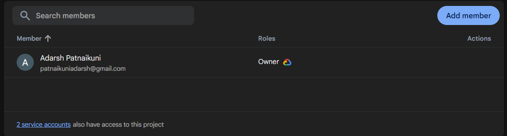

# 🛍️ Smart Shopping App - Firebase Based Dynamic Cart Management System

## 👑 Project Lead & Developer

| | |
|---|---|
| **👨‍💻 Name** | **P. Adarsh** |
| **Roll Number** | **A24126510152** |
| **Role** | **Team Leader & Data analyst** |

---

## 👥 Team Members & Contributions

| Roll Number | Name | Role | Contributions |
|-------------|------|------|---------------|
| A24126510152 | **P. Adarsh** | **Team Leader & Developer** | **Full app development, Firebase integration, CartManager, Checkout, Order History, GitHub setup** |
| A24126510125 | Ch. Teja | UI/UX Designer | Designed XML layouts, Material Design implementation, Screenshot preparation |
| A24126510121 | A. Maneesh Chowdary | Documentation & Testing | Project documentation, Test cases, PPT presentation, Showcase preparation |

---

## ✨ Features
- Firebase Authentication (Email/Password)
- Real-time Product Catalog
- Instant Search with TextWatcher
- Smart CartManager (Singleton Pattern)
- Dynamic "ADDED" Button (turns green)
- Validated Checkout (Phone & Address required)
- Personalized Order History

## 🛠️ Tech Stack
- Java, Android SDK, Firebase Realtime Database, Firebase Auth

## 🔥 Firebase Setup

### Orders Node (with real data)
![Orders] 

### Authentication Users

## 📱 App Screenshots

1.LOGIN ACTIVITY 
2. ACTIVITY MAIN 
3. MY CART 
4. ORDERS LISTS 
5. CHECKOUT LIST 

## 🎥 Demo Video
[Watch Demo] 

## 🔧 How to Run
1. Clone repo
2. Open in Android Studio
3. Add `google-services.json`
4. Build and run

## 🏫 Institution
ANIL NEERUKONDA INSTITUTE OF TECHNOLOGY & SCIENCES (A)

## 📅 Year
2025-2026
                ↓
        OrderHistoryActivity
