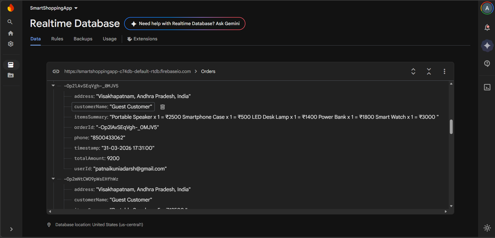
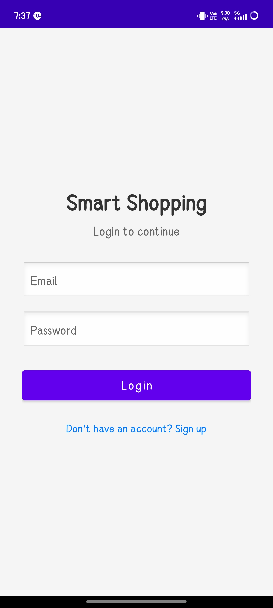
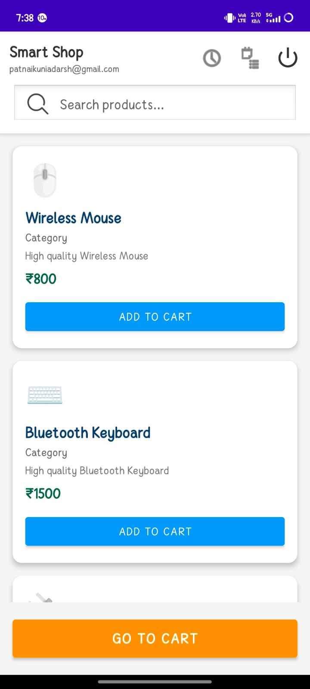
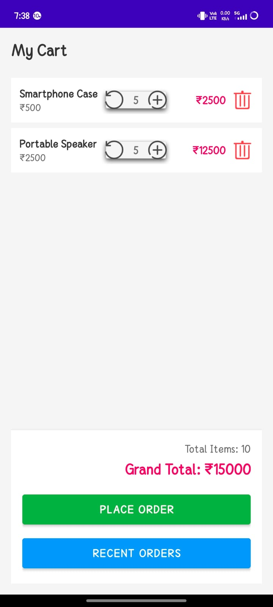
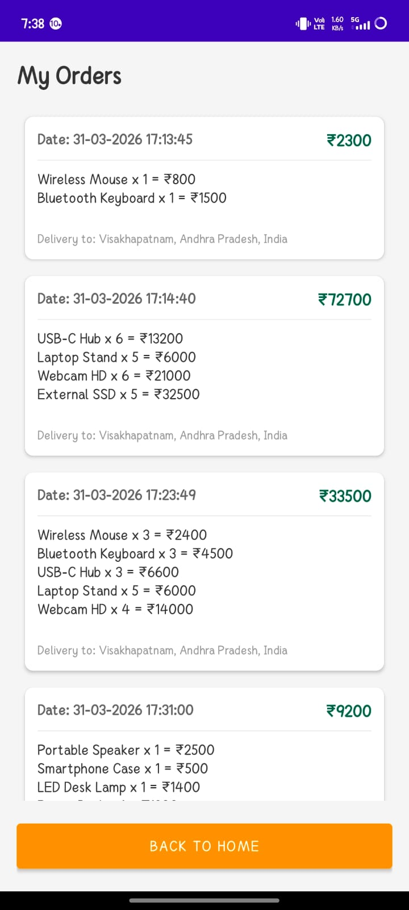

# 🛍️ Smart Shopping App - Firebase Based Dynamic Cart Management System

## 👑 Project Lead & Analyst 

| | |
|---|---|
| **👨‍💻 Name** | **P. Adarsh** |
| **Roll Number** | **A24126510152** |
| **Role** | **Team Leader & Data Analyst** |

---

## 👥 Team Members

| Roll Number | Name | Role | Contributions |
|-------------|------|------|----------------|
| A24126510152 | **P. Adarsh** | **Team Leader & Developer** | Full app development, Firebase, CartManager, GitHub |
| A24126510125 | Ch. Teja | UI/UX Designer | XML layouts, Material Design, Screenshots |
| A24126510121 | A. Maneesh Chowdary | Documentation & Testing | Project docs, PPT, Showcase |

---

## ✨ Features

- Firebase Authentication (Email/Password)
- Real-time Product Catalog
- Instant Search with TextWatcher
- Smart CartManager (Singleton Pattern)
- Dynamic "ADDED" Button (turns green)
- Validated Checkout (Phone & Address required)
- Personalized Order History

---

## 🛠️ Tech Stack

- Java, Android SDK, Firebase Realtime Database, Firebase Auth

---

## 🔥 Firebase Configuration

### Orders Node

### Authentication Users

---

## 📱 App Screenshots

| Login | Product Home | Cart |
|-------|--------------|------|
|  |  |  |

| Checkout | Order History |
|----------|---------------|
|  |  |

---

## 🔧 How to Run

1. Clone the repo
2. Open in Android Studio
3. Add `google-services.json`
4. Build and run

---

### 5. Key Technical Achievements

## 🏆 Key Technical Achievements

| Achievement | Description |
|-------------|-------------|
| **Real-time Sync** | Firebase listeners update UI instantly when database changes |
| **Singleton Cart** | Single cart instance across all app activities |
| **Dynamic UI** | "ADDED" button changes color and text on item addition |
| **Dual Loading** | Local sample data + Firebase data for instant visibility |
| **Smart Validation** | Phone & address required, name defaults to "Guest" |
| **Client-side Filtering** | Orders filtered by logged-in user email |
| **Offline Support** | Firebase caching works without internet |

---

## 🧭 Screen Navigation Details

| From Screen | To Screen | Trigger | Data Passed |
|-------------|-----------|---------|-------------|
| SplashScreen | LoginScreen | Click "Start Shopping" | None |
| LoginScreen | ProductHomeScreen | Successful login | User email via CartManager |
| LoginScreen | SignupScreen | Click "Don't have account?" | None |
| SignupScreen | ProductHomeScreen | Successful signup | User email via CartManager |
| ProductHomeScreen | CartScreen | Click cart icon or "GO TO CART" | Cart items via CartManager |
| CartScreen | CheckoutScreen | Click "PLACE ORDER" | Cart items, total amount |
| CheckoutScreen | OrderHistoryScreen | After order placed | Order confirmation |
| CartScreen | OrderHistoryScreen | Click "RECENT ORDERS" | None |
| Any Screen | LoginScreen | Session expired / Logout | None |

---

## 🏫 Institution
**ANIL NEERUKONDA INSTITUTE OF TECHNOLOGY & SCIENCES (A)**

## 📅 Academic Year
2025-2026
